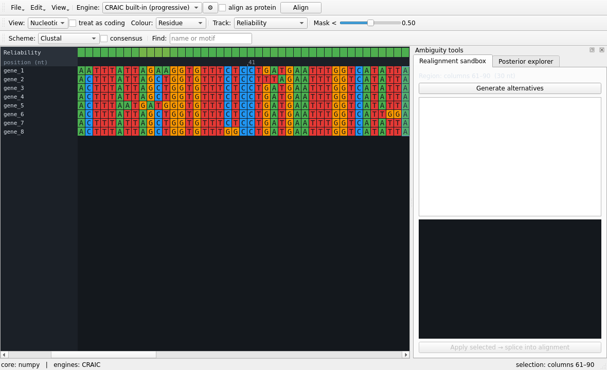

# CRAIC — Conserved-Region Alignment by Iterative Convergence

[](https://github.com/mol-evol/craic/actions/workflows/ci.yml)
[](https://pypi.org/project/craic-msa/)
[](https://pypi.org/project/craic-msa/)
[](LICENSE)
[](https://mol-evol.github.io/craic/)

CRAIC — short for *Conserved-Region Alignment by Iterative Convergence* — is a desktop
workbench for building, viewing, and — above all — *interrogating*
multiple sequence alignments. It treats the alignment not as settled truth but as a
hypothesis you can stress-test, especially in the ambiguously aligned regions where
downstream phylogenetics so often goes quietly wrong.

**Install:** `pip install craic-msa` then run `craic`.  ·  **Website:** <https://mol-evol.github.io/craic/>

Written by [James McInerney](https://mol-evol.github.io/), University of Liverpool.
If you use CRAIC, please [cite it](#citation).

It also runs headless: `craic score`, `craic mask`, `craic align`, `craic trim` and
`craic simulate` need no display and never import Qt, so the same reliability
numbers you see in the viewer can be produced on a cluster node or inside a
pipeline.

It handles nucleotides, codons, and amino acids from a single canonical representation
and lets you switch between them live, so you can align at whatever level is most
informative and read the result at whatever level you think in.



## What makes it different

Most viewers show you one alignment and one coloring. CRAIC gives you four
complementary, evidence-based views of where an alignment is trustworthy and where it
is guessing:

**1 · Reliability overlay + live masking.** Every column and residue gets a confidence
score from two independent signals — a *consistency* score (the pair-HMM posterior that
the residues a column groups together really are homologous, in the spirit of T-Coffee's
TCS / ZORRO) and a *perturbation* score (how many of a residue's asserted homologies
survive re-alignment across an ensemble of perturbed guide trees and gap regimes — a
stability probe in the spirit of GUIDANCE, though not equivalent to it; see *Scope and
honest limitations*). A threshold slider previews exactly which columns a mask would
drop — *before* you commit — and exports the masked alignment.

Both scores are computed under pair-HMM parameters estimated from the alignment being
scored, not under a fixed default, and a column that cannot be scored at all is dropped
by the mask rather than silently kept.

**2 · Multi-aligner disagreement map.** Run several aligners (or, with no external tools
installed, several gap regimes of the built-in engine), project them onto a common
coordinate, and color each column by how often the methods agree. Where they fight is
where you should look. This is one of the most honest signals of alignment ambiguity, and — while tools
like SuiteMSA and ALVIS can compare alignments — few interactive viewers surface it
live alongside the reliability track and posterior explorer.

**3 · Local realignment sandbox.** Select a hard block, re-align *just that block* under
alternative engines, gap costs, and guide orders, compare the alternatives side by side
with a quality score, and splice your chosen version back in without disturbing the rest
of the alignment. Human-in-the-loop, the way difficult regions are actually resolved.

**4 · Alignment posterior explorer.** Instead of one hard column assignment, see the
pair-HMM forward–backward posterior for a region as a heatmap — bright off-diagonal mass
*is* the set of alternative homology hypotheses. Four ways to read it, because a confident
alignment is mostly a boring bright diagonal and the *interesting* part is what's off it:

- **Colour by confidence** — shade the alignment residues themselves by per-residue
  reliability, so uncertain residues light up exactly where you're already looking.
- **Probe a residue** — click any residue to paint its "homology cloud" across the
  alignment: the other columns it could plausibly belong to. Answers *could this slide?*
- **Residual mode** — subtract the committed alignment so the diagonal goes dark and only
  the genuine alternative-homology mass remains.
- **Profile mode** — one sequence vs the rest, so the picture reflects the whole MSA
  rather than an arbitrary pair.

## Teaching with a known answer

Real data never comes with the answer, which is why alignment is usually taught
as a solved preliminary: press Align, get a result, move on. CRAIC can supply the
answer.

**Teach → Generate dataset with known answer…** simulates sequences down a random
tree — you choose the divergence, the indel load and the amount of among-site
rate variation — and loads them *unaligned*, keeping the true alignment. Align
them however you like, then pick the **Reference correctness** track to see
exactly which columns the aligner got wrong, next to the reliability track that
tried to predict it. **Teach → Load reference alignment…** does the same with a
structural reference such as BAliBASE for real data.

The status bar reports SP, TC and the reliability AUC, so "the score works" stops
being a claim in a paper and becomes something a student watches happen — or
watches fail, which is at least as instructive. The track and the numbers stay
live while you edit: nudge a residue, move a block, and the accuracy moves with
you.

A track says *that* a column is wrong. Three further views say what the right
answer was. Colouring by **Correct placement** paints every residue by whether it
sits with the partners the true alignment gives it, so one red cell in a green
column names the sequence that broke it. The **Column inspector** states the
answer in words — which residues belong together, which intruder is present and
how far it should move, which residue is missing and where it went — with every
column it names a link. And **Show the true alignment** (`Ctrl+T`) simply puts
the answer on screen, read-only, for the student who wants to stop deducing and
look.

## Sessions, and not losing work

A curation session is more than its alignment: it is also the reference you are
scoring against, the annotations, the sequence groups, the provenance log of how
the alignment was arrived at, and the view state that makes any of it legible.
Exporting FASTA or NEXUS keeps the residues and drops the rest — fine as an
export, useless as a way to put work down and pick it up tomorrow.

So CRAIC has a session document: readable JSON, versioned, holding all of it.
**File → Save session** (`Ctrl+S`) writes one; **Open session…** restores it, and
a `.craic.json` also opens straight from the ordinary Open dialog. Exporting the
alignment to a standard format is **Save alignment as…** (`Ctrl+Shift+S`) and is
unchanged.

Alongside it:

- The title bar carries a `•` while there are unsaved changes, and closing with
  them offers **Save / Discard / Cancel** rather than discarding them silently.
- The session is autosaved to CRAIC's own application-data directory a few
  seconds after each change — never beside your data — and offered back on the
  next launch if CRAIC did not exit cleanly. A clean exit removes it, so a
  recovery prompt always means something went wrong.

`craic session work.fasta.craic.json` prints what a session holds, including the
whole provenance log, and `-o` exports its alignment.

## Command line

```bash
craic simulate --taxa 12 --divergence 0.4 -o truth.fasta --unaligned seqs.fasta
craic align seqs.fasta -o aln.fasta            # or --engine mafft
craic score aln.fasta --reference truth.fasta -o scores.tsv
craic mask  aln.fasta --threshold 0.5 -o masked.fasta
craic trim  aln.fasta --method gappyout -o trimmed.fasta
craic session work.fasta.craic.json            # what is in a saved session
```

`craic` with no arguments, or with a file, still opens the workbench. Output goes
to stdout when `-o` is omitted, and progress to stderr, so the subcommands pipe.
`craic --core` reports whether the Rust core or the NumPy fallback is in use.

## Design

Everything is unified on one primitive: posterior "match" probabilities from a 3-state
pair-HMM (match / insert / delete, affine gaps), computed by forward–backward in log
space — the ProbCons idea. That one matrix powers the posterior explorer, the reliability
consistency score, and a maximum-expected-accuracy built-in aligner.

```
craic/
  accel.py          dispatch to the Rust core or a NumPy mirror (identical results)
  domain.py         canonical model + nt / codon / aa projection, genetic codes
  io.py             FASTA / PHYLIP / Clustal / Stockholm / NEXUS
  progressive.py    built-in progressive aligner (always available)
  engines.py        AlignerEngine interface + external aligner wrappers
                    + a codon-aware (translate→align→back-translate) decorator
  evaluate.py       accuracy against a known-true reference (SP, TC, per-column)
  simulate.py       ground-truth simulator: sequences whose alignment is known
  cli.py            headless align / score / mask / trim / simulate / session
  session.py        the working session as a versioned JSON document
  ambiguity/        reliability · disagreement · sandbox · posterior
  gui/              PySide6 desktop front-end
                    document.py  the working state, separate from the widgets
                    tracks.py    the column overlays, described once
                    canvas.py · panels.py · dialogs.py · colors.py
src/lib.rs          the pair-HMM core (PyO3), with a pure-NumPy fallback
```

The performance-critical inner loop is in **Rust** (≈50× faster than the NumPy
fallback, which mirrors it recursion for recursion). Where both are present the
test-suite checks that they agree; note that those checks necessarily skip when
the Rust core is absent, which is exactly the configuration in which the NumPy
path is doing the science. If the Rust core isn't compiled, CRAIC runs anyway on
NumPy — but the fallback is a correctness fallback, not a performance one, and is
impractically slow on anything beyond small families.

## Installation

CRAIC needs **Python 3.9+** and runs on macOS, Windows, and Linux. Full details are
in the [installation guide](https://mol-evol.github.io/craic/installation/).

**Just want a double-clickable app (no Python)?** Grab a standalone bundle from the
[latest release](https://github.com/mol-evol/craic/releases) — `CRAIC-macos.dmg`,
`CRAIC-windows.zip`, or `CRAIC-linux.tar.gz`. They're unsigned, so the first launch
needs a one-time bypass (macOS: System Settings → Privacy & Security → "Open Anyway"; Windows: "More
info → Run anyway") — see the [installation guide](https://mol-evol.github.io/craic/installation/#download-a-ready-to-run-app).

**From PyPI (recommended)** — a prebuilt wheel with the Rust core bundled, no compiler
needed:

```bash
pip install craic-msa
craic                                 # launch the GUI
craic examples/coding_genes.fasta     # …or open a file
```

On Linux, PySide6 needs a few Qt system libraries:
`sudo apt-get install -y libegl1 libgl1 libxkbcommon0 libdbus-1-3`.

**From source** — needs [Rust](https://rustup.rs) for the acceleration core (or skip it
and use the NumPy fallback):

```bash
git clone https://github.com/mol-evol/craic && cd craic
python3 -m venv .venv && source .venv/bin/activate
pip install maturin && maturin develop --release
pip install -e .
craic examples/coding_genes.fasta
```

No Rust? `pip install numpy biopython PySide6` then `python -m craic` runs on the
NumPy fallback. The status bar shows `core: rust` once the native core is present,
otherwise `core: numpy`.

Once it's open: load sequences or an alignment, pick an engine, press **Align**
(tick **align as protein** for coding nucleotides). Toggle **View** between
nucleotide / codon / amino acid, and pick a **Track** (Conservation, Reliability,
Aligner agreement, …) to overlay confidence. Click-drag a column range to drive the
realignment sandbox and posterior explorer; single-click a residue to probe it.

## Optional: external aligners

CRAIC auto-detects any of these on your `PATH` and offers them in the engine menu and the
disagreement comparison: **MAFFT**, **MUSCLE**, **Clustal Omega**, **ProbCons**, **PRANK**,
**ClustalW**. None are required — the built-in aligner always works. Each engine's settings
(gap costs, matrices, strategies) are behind the ⚙ button, or `--param` on the command line.
Coding data can be aligned in amino-acid space (translate → align amino acids →
back-translate) via the *align as protein* checkbox.

## Examples

`examples/` ships two small datasets with deliberately ambiguous regions:
`coding_genes.fasta` (protein-coding, a variable-length loop between conserved cores) and
`rrna_loops.fasta` (non-coding, hypervariable loops between conserved stems). Regenerate
them with `python examples/make_examples.py`.

## Tests

```bash
pip install pytest
pytest tests          # core tests; GUI smoke tests run if PySide6 is importable
```

## Scope and honest limitations (v1)

- The codon-aware path assumes reading frame 0 and intact frames; it surfaces partial-gap
  codons as `X` (a frameshift flag) rather than modelling frameshifts the way MACSE does.
- Masking removes columns at nucleotide granularity and drops the coding annotation;
  codon-respecting masking is a natural next step.
- The built-in aligner does genuine ProbCons-style posterior decoding (data-estimated
  parameters, a posterior-derived guide tree, the consistency transformation, and
  maximum-expected-accuracy), with a min/med/max compute level and automatic streaming for large
  families (bounded memory); it is meant to always be available, not to out-perform MAFFT, so for
  production alignments wire in an external engine. One departure from ProbCons
  worth knowing: for protein data a single matrix is used regardless of the
  estimated divergence. That matrix is BLOSUM45 rather than the more usual
  BLOSUM62, because it measured better on BAliBASE core blocks at both
  divergence levels tested (see [Validation](docs/validation.md)).
- The consistency transformation is **sparsified** when SciPy is installed
  (`pip install craic-msa[speed]`), thresholding posteriors at 0.01 as ProbCons
  does. That is an approximation, not a refactor: it holds a few per cent of the
  dense memory and is several times faster on long sequences, and on simulated
  data the resulting alignments are usually identical and never materially less
  accurate — but they are not guaranteed bit-identical, and the dense path
  remains available (`sparse=False`) for comparison. Below ~350 columns the
  dense product is faster and is chosen automatically.
- The **perturbation score is a sensitivity probe, not GUIDANCE.** GUIDANCE
  bootstraps alignment columns to build perturbed guide trees and re-aligns with
  the same aligner that produced the reference, over ~100 replicates. CRAIC uses
  16 replicates of its own built-in engine under plain posterior decoding. On an
  alignment CRAIC produced, that is a genuine guide-tree/gap-model stability
  measure. On an alignment MAFFT or PRANK produced, it also picks up systematic
  between-method difference, so read the disagreement map alongside it.
- The **consistency score is a goodness-of-fit under CRAIC's own model.** It
  recomputes posteriors from the unaligned sequences, which is not nothing, but
  for a CRAIC-built alignment the score and the alignment come from the same
  pair-HMM. It is not independent evidence in the way TCS — which scores against
  a library built from different pairwise alignments — is.
- The **posterior explorer's window is anchored on the committed alignment.**
  Each region is computed on substrings chosen by the current alignment's own
  coordinates with a fixed margin, so alternative homologies further away than
  that margin are not merely dim, they are outside the picture. Widen the
  selection to look further.

## Method lineage

The ideas here build on ProbCons (posterior decoding), T-Coffee/TCS and ZORRO (column
reliability from consistency), GUIDANCE (reliability from guide-tree perturbation),
PRANK (phylogeny-aware gap placement), and MACSE (codon-aware alignment). CRAIC's
contribution is to put these uncertainty signals *in front of the user, interactively*,
in one viewer.

## Contributing

Bug reports, ideas, and pull requests are welcome — see
[CONTRIBUTING.md](CONTRIBUTING.md) and the issue tracker at
<https://github.com/mol-evol/craic/issues>.

## Citation

If you use CRAIC in your research, please cite:

> McInerney J. 2026. CRAIC: interactive interrogation of multiple sequence alignment
> uncertainty. bioRxiv preprint (link to follow).

The paper is under review; this will become the journal citation when it is
published. GitHub's "Cite this repository" button gives the same citation in other
formats, from [`CITATION.cff`](CITATION.cff). The
[About page](https://mol-evol.github.io/craic/about/) on the website always has the
current version.

## License

CRAIC is released under the [MIT License](LICENSE). © 2026 James McInerney.
