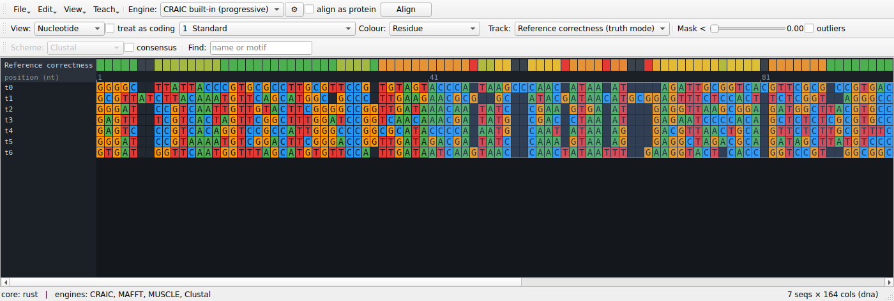
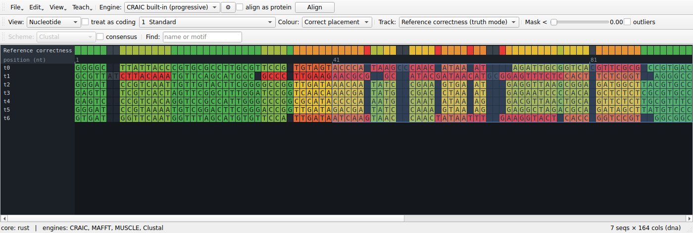
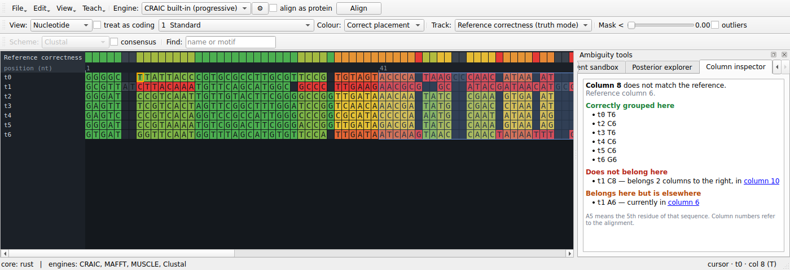
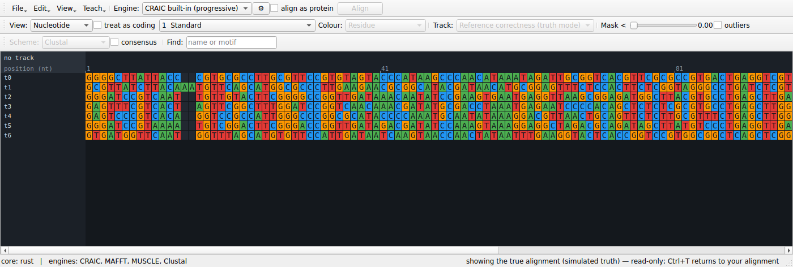

# Teaching with a known answer

Alignment is usually taught as a solved preliminary. Press Align, accept what
comes out, move on to the tree. A student can complete an entire phylogenetics
practical without once meeting the idea that the alignment is a *hypothesis* —
and the uncertainty machinery they do meet, bootstrap values on a tree, says
nothing about whether the alignment underneath was right.

The obstacle is simple: with real data nobody knows the answer, so there is
nothing to compare against. CRAIC's **Teach** menu supplies an answer.

## Generate a dataset whose answer is known

**Teach → Generate dataset with known answer…**

Sequences are evolved down a random binary tree with substitutions and
insertions/deletions, so the homology of every residue is known exactly. You
choose:

| Control | What it changes |
|---|---|
| **Sequences** | how many taxa |
| **Root length** | how long the ancestral sequence is |
| **Divergence** | upper bound on branch lengths — higher is harder to align |
| **Indel rate** | how many insertions and deletions occur; this is the dial that *creates* ambiguity, because substitutions alone never make a column doubtful |
| **Rate variation (alpha)** | gamma shape for among-site rate variation; 0 means every site evolves at the same rate |
| **Seed** | same seed, same dataset — so a whole class can work on identical data |

The **unaligned** sequences are loaded, because aligning them is the exercise.
The true alignment is kept out of sight as the reference.

!!! note "Why the rate-variation dial matters"
    With uniform rates the simulated data is close to what CRAIC's own pair-HMM
    assumes, which flatters CRAIC relative to aligners carrying empirical
    parameters. Turning rate variation on is the harder and more realistic test,
    and a good thing to have students compare.

## Turn on truth mode

Align the sequences however you like — the built-in engine, or MAFFT if it is
installed — then choose the **Reference correctness** track.

{ width="100%" }

Every column is now coloured by the fraction of the homologies it asserts that
are actually true. Green columns are right; red columns are places the aligner
invented homology that does not exist. The status bar reports:

- **SP** — the fraction of true homologous residue pairs the alignment recovered
- **TC** — the fraction of true columns reproduced exactly
- **reliability AUC** — how well CRAIC's reliability score predicted which
  columns would be wrong (0.5 is chance)

Now switch between the **Reliability** track and the **Reference correctness**
track. That comparison is the whole lesson: the reliability score is a prediction,
and here you can see it being right, and see it being wrong.

## See the answer, not just the verdict

A track tells you *that* a column is wrong. Three further views tell you what the
right answer was.

### Colour by correct placement

Set **View → Correct placement**. Every residue is now coloured by whether it
sits with the partners the true alignment gives it — green for yes, red for no,
grey for a residue with no partners in its column, which asserts nothing and so
can be neither right nor wrong.

{ width="100%" }

This is the per-residue version of the correctness track, and it is exactly
consistent with it: a column's score is the mean of its residues' scores. What it
adds is the culprit. A column at 0.8 might be eight sequences that agree and two
that do not, or a general mess; coloured this way, one red cell in a green column
names the sequence that broke it.

The colouring stays on while you edit, so dragging a block recolours the residues
it moved.

### Read the answer in the column inspector

Open **View → Ambiguity tools panel** and choose the **Column inspector** tab,
then click any column. It states what the reference says about it:

> **Column 8** does not match the reference. Reference column 6.
>
> **Correctly grouped here** — `t0` T6, `t2` C6, `t3` T6, `t4` C6, `t5` C6, `t6` G6
>
> **Does not belong here** — `t1` C8: belongs 2 columns to the right, in column 10
>
> **Belongs here but is elsewhere** — `t1` A6: currently in column 6

{ width="100%" }

Every column it names is a link, so following a displaced residue to where it
actually sits is one click. The panel follows the edit cursor, so the arrow keys
walk along the alignment reading the answer column by column.

Note that a column can score a perfect 1.0 and still be listed here as
incomplete. The score asks whether the homologies a column *asserts* are true; a
column that quietly left a residue out asserts nothing false. Seeing both at once
is a good way to make the difference between SP recall and precision concrete.

### Look at the true alignment itself

{ width="100%" }

**Teach → Show the true alignment** (`Ctrl+T`) replaces the view with the
reference. It is read-only — editing and realigning are refused while it is up,
and your own alignment is untouched — and `Ctrl+T` again returns you to it, with
the view you had. Useful for the student who wants to stop deducing and just
look.

## What to do with it

A few exercises that work:

- **Find the breaking point.** Start at low divergence and raise it until SP
  falls apart. Alignment does not degrade gracefully; it degrades suddenly, and
  seeing where is worth more than being told.
- **Does masking help?** Mask at a threshold, then ask whether the columns it
  removed were the wrong ones. Compare against removing the same number of
  columns arbitrarily — the honest comparison, and usually a surprise.
- **Do aligners disagree where it matters?** Turn on the aligner-agreement track
  and check whether the columns the methods fight over are the ones that are
  actually wrong.
- **Align it by hand.** Edit a hard block manually and watch SP change as you do.
  The correctness track, the per-residue colouring and the accuracy figures all
  update after every edit, so a nudge that helps and a nudge that hurts look
  different immediately. Undo works normally, and restores the previous score
  with it.
- **Repair a column.** Pick a red column, read the inspector, move the residue it
  names to the column it names, and watch both go green. Doing this two or three
  times teaches what an alignment error actually *is* faster than any amount of
  explanation.

## With real data

**Teach → Load reference alignment…** does the same thing with a trusted
alignment of the same sequences — a structural reference such as BAliBASE or
HOMSTRAD. Everything above then applies to real sequences with real ambiguity.

The reference is matched by sequence identifier, tolerating the whitespace
truncation some aligners apply, and is checked to be an alignment of the *same*
residues. A reference for different data is refused rather than scored, because
a reference for the wrong sequences would otherwise look like an alignment that
is entirely wrong.

The reference survives realignment on purpose. Align, look at the damage, change
the engine or the gap costs, align again, and watch the correctness track change
underneath you. **Teach → Forget reference alignment** turns truth mode off.

## From the command line

The same comparison is available headless, which is how to do it over many
datasets at once:

```bash
craic simulate --taxa 12 --divergence 0.4 --indel 3 \
    -o truth.fasta --unaligned seqs.fasta
craic align seqs.fasta -o aln.fasta
craic score aln.fasta --reference truth.fasta -o scores.tsv
```

`scores.tsv` carries per-column reliability and per-column correctness side by
side; SP, TC and the reliability AUC are printed to stderr.
