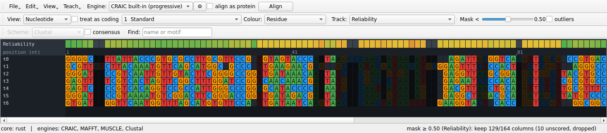

# CRAIC

**Conserved-Region Alignment by Iterative Convergence** — a desktop workbench for building,
viewing, and, above all, *interrogating* multiple sequence alignments. It is built around the
ambiguously aligned regions where downstream phylogenetics so often goes quietly wrong.

{ width="100%" }

## What it does

- A fast, virtualised **alignment viewer** that shows nucleotides, codons, or amino acids
  from a single canonical model and switches between them live.
- Four **ambiguity tools** — a reliability overlay with live masking, a multi-aligner
  disagreement map, an interactive realignment sandbox, and a posterior explorer.
- A **teaching mode**: generate sequences whose true alignment is known, align
  them, and see exactly which columns the aligner got wrong beside the
  reliability score that tried to predict it — then read, residue by residue,
  what the right answer was.
- A **headless command line** — `craic score`, `mask`, `align`, `trim`,
  `simulate` — that needs no display.
- A **Rust** acceleration core (with a NumPy fallback that mirrors it, for correctness
  rather than for speed) behind a clean
  Python API.

New here? Start with **[Getting started](getting-started.md)**, then walk through the
**[viewer](guide/viewer.md)** and the **[ambiguity tools](guide/ambiguity-tools.md)**.

Wondering why this exists when you already have an alignment viewer? —
**[Background & intent](background.md)**. Wondering whether the reliability score
actually works? — **[Validation](validation.md)**, and the
**[limitations](limitations.md)** that go with it. Wondering how it works? —
**[Concepts & methods](concepts.md)**.

## A short tour

<!-- Record a screencast, save it as docs/assets/walkthrough.mp4, and it appears here. -->
<video controls width="100%" poster="assets/confidence-colouring.png">
  <source src="assets/walkthrough.mp4" type="video/mp4">
  No screencast yet — drop one at <code>docs/assets/walkthrough.mp4</code> and it plays here.
</video>

!!! tip "This page is just Markdown"
    Everything you see is generated from plain Markdown files in `docs/`. To change it, edit
    the file and refresh — see **[Editing these docs](editing-docs.md)**.
