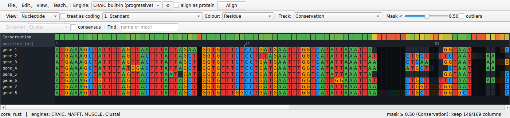

# Interface reference

Every control in the CRAIC window, top to bottom. The window has three toolbar rows, the central
alignment canvas, a dockable **Ambiguity tools** panel on the right (hidden by default — open it from the **View** menu), and a status bar.

{ width="100%" }

## Toolbar — File / Edit row

Document actions live under dropdown buttons at the left of the row — **File ▾** (load, save,
export, history), **Edit ▾** (clipboard and alignment edits), **View ▾** (show/hide panels),
**Teach ▾** (known-answer tools, see [Teaching](../guide/teaching.md)) and **Help ▾** (the
website, and who wrote CRAIC and how to cite it).
Keyboard shortcuts work whether or not a menu is open; every action except **Open…** is disabled
until an alignment is loaded.

| Control | What it does | Notes |
| --- | --- | --- |
| **File ▾ → Open…** | Load sequences or an alignment. | Ctrl/⌘+O. Reads FASTA, PHYLIP, Clustal, Stockholm, NEXUS (by extension). Unaligned input is padded and you're prompted to **Align**. |
| **File ▾ → Save…** | Write the current alignment. | Ctrl/⌘+S. FASTA, Clustal, PHYLIP, Stockholm, NEXUS, MEGA. |
| **File ▾ → Export image…** | Save the whole alignment as a PNG (current zoom and level). | |
| **File ▾ → Export masked…** | Write the alignment with low-confidence columns removed. | Uses the current **Track** + **Mask** threshold (set on the View / Analyse row). FASTA output (the coding annotation is dropped). |
| **File ▾ → Export figure…** | Open a dialog to render a publication figure — the alignment, a confidence report, an uncertainty logo, homology arcs / co-occurrence (you pick the two sequences), a homology card, or an interactive HTML view — as PDF / SVG / PNG. | Choosing the sequences in the dialog is why paired figures no longer silently use the first two. |
| **File ▾ → Compare with alignment…** | Load a second alignment and overlay a per-column agreement track (red where the two place residues differently). | Compares by shared sequence names. |
| **File ▾ → History…** | Show the provenance log — what produced the current alignment, in order (open, alignments, realignments, edits). | Written as a `*.craic-history.txt` sidecar when you **Save**, so a hand-built multi-program alignment stays reproducible. |
| **Edit ▾ → Copy ▸** | Copy the selection (or whole alignment) to the clipboard at the viewed level, in a format you pick from the submenu: FASTA, Clustal, PHYLIP (interleaved / relaxed / sequential), Stockholm, NEXUS, MEGA. | Ctrl/⌘+C copies **FASTA** directly. Same format set as **Save**; copies the displayed residues (bases, codons, or amino acids). |
| **Edit ▾ → Select all** | Select every column of the alignment. | Ctrl/⌘+A. Feeds the selection to Copy and to the ambiguity panels. |
| **Edit ▾ → Sort by similarity** | Reorder sequences so similar ones sit together (k-mer nearest-neighbour chain). | |
| **Edit ▾ → Remove gap columns** | Drop columns that are gaps in every sequence (whole gap-only codons when coding). | |
| **Edit ▾ → Go to next ambiguous region** | Jump the selection to the next low-reliability hotspot. | Ctrl/⌘+G. Computes reliability on demand the first time. |
| **Edit ▾ → Edit alignment ▸** | Undo/Redo plus structural edits: nudge a residue, insert a gap column, delete an empty column, pin and unpin trusted columns, realign around the pinned ones. | The everyday way to edit is the keyboard (see [Keyboard & mouse](shortcuts.md)); these are the menu equivalents, all undoable and logged. |
| **Edit ▾ → Sequence groups ▸** | Save the selected sequences as a named set (e.g. "animals"), then re-select them in one click to slide them together. | Stored in the `<file>.craic.json` sidecar. |
| **Edit ▾ → Annotations ▸** | Add a named, coloured column feature (helix, active site, …) from the selection; select one to highlight its columns; export only the annotated columns. | Shown in a band at the bottom; stored in the sidecar. |
| **View ▾ → Ambiguity tools panel** | Show or hide the **Ambiguity tools** dock (sandbox, posterior explorer, column inspector). | **Hidden by default** — use this to show it, and to bring it back if you've closed it with its **×**. |
| **View ▾ → Bigger / Smaller / Reset text size** | Zoom the residue font and cells. | Ctrl/⌘ `+` / `-` / `0`, or Ctrl/⌘ + scroll over the alignment. |
| **Help ▾ → CRAIC website** | Open <https://mol-evol.github.io/craic/> in your browser. | |
| **Help ▾ → About CRAIC and how to cite it…** | Version, author (with a link to <https://mol-evol.github.io/>), the website, and the citation. | **Copy citation** puts the citation on the clipboard. See [About & citation](../about.md). |
| **Engine** | The aligner used by **Align**. | Always lists *CRAIC built-in (progressive)*; adds MAFFT, MUSCLE, Clustal Omega, PRANK if found on `PATH`. See [Engines](engines-and-formats.md). |
| **⚙** (parameters) | Edit the selected engine's parameters — gap costs, MAFFT strategy/`--op`/`--ep`, Clustal Omega iterations, PRANK gap rates. | Opens a small dialog with **Restore Defaults**. Settings are remembered per engine for the session and are used by both **Align** and the *Aligner agreement* track. Engines with no tunable knobs (e.g. MUSCLE v5) say so. |
| **align as protein** | Translate the coding nucleotides, align the amino acids, then thread the original nucleotides back through that alignment. | Only effective for nucleotide data. Assumes reading frame 0. The nucleotides stay in memory and the result carries a coding annotation, so the nt / codon / amino-acid views all work; the view switches to amino acid automatically when alignment finishes. |
| **Align** | Re-align the current sequences with the chosen engine. | Runs in the background with a progress dialog you can **Cancel** (handy because the built-in aligner is pure-Python and slow on large alignments — use MAFFT for those). Operates on the ungapped sequences. |

## Toolbar — View / Analyse row

| Control | What it does | Notes |
| --- | --- | --- |
| **View** | Switch the display level: *Nucleotide*, *Codon*, *Amino acid*. | Only levels valid for the data are listed (codon/aa need a coding nucleotide alignment, or protein data). |
| **treat as coding** | Mark a plain nucleotide alignment as coding (reading frame 0) so the codon/aa views become available. | Disabled for protein data. Warns if the result contains internal stop codons. |
| **genetic code** | The NCBI translation table used by the codon and amino-acid views and by **align as protein**. | Defaults to 1 (Standard). Mitochondrial and Mollicute sequences do not use it: vertebrate mitochondria are table 2, *Mycoplasma* and *Spiroplasma* table 4. Getting this wrong turns real tryptophans into stop codons, and a stop carries no homology signal, so it degrades the alignment as well as the display. Changing it re-reads the alignment immediately. |
| **Colour** | *Residue*, *Confidence*, or *Correct placement*. Residue colours follow the level: bases (nt), the encoded amino acid (codon), or the residue (aa). | Choosing *Confidence* runs the reliability analysis automatically if needed. *Correct placement* colours each residue by whether it sits with the partners a known-true alignment gives it, and needs a reference — it is offered only when one is loaded, and it survives an edit so the colours move as you work. |
| **Track** | Per-column overlay: *(none)*, *Conservation*, *Reliability*, *Consistency*, *Perturbation*, *Aligner agreement*, and the model-free trimmers *Gap fraction (MSA_trimmer)*, *Similarity (trimAl)*, *trimAl gappyout*, *trimAl strict*, *Gblocks*. | Choosing a track computes whatever it needs on demand and shows it — *Conservation* and the trimmers are instant; *Reliability / Consistency / Perturbation* run the reliability analysis once, then cache; *Aligner agreement* re-aligns with every installed engine **at its current ⚙ settings** and overlays how often they reproduce the **current** alignment's columns (it does not replace the alignment). *Gap fraction* and *Similarity* are score bands the **Mask <** slider trims; *gappyout / strict / Gblocks* choose their own columns automatically (the slider yields to their decision). The mask and Confidence colouring use the active track. |
| **Mask <** | Threshold slider (0.00–1.00, default 0.50). | Columns whose current-track score is **below** the threshold dim out as a live preview; the status bar shows how many survive. Columns with no score are kept. Write the result with **File ▾ → Export masked…**. |
| **outliers** | Flag whole sequences that align poorly with the rest (EvalMSA / OD-seq-style: robust-MAD threshold on each sequence's mean pairwise column similarity). | Flagged sequences get a red marker in the name column. Independent of the level and the column mask; recomputed when ticked. |

## Toolbar — Display row

| Control | What it does | Notes |
| --- | --- | --- |
| **Scheme** | Amino-acid colour scheme: *Clustal*, *Zappo*, *Taylor*, *Hydrophobicity*. | Applies to amino-acid and codon views; nucleotides always colour by base. |
| **consensus** | Show a consensus row beneath the alignment (commonest residue per column, at the current level). | |
| **Find** | Jump to and highlight a sequence by name, or a residue/codon motif. | Type and press Return. |

## The alignment canvas

The canvas is virtualised — only on-screen cells are drawn — so it stays fast on large
alignments. Around the grid:

- **Name gutter** (left) — sequence IDs, fixed while you scroll horizontally.
- **Ruler** — column positions, ticking at a spacing that adapts to zoom.
- **Track band** (top) — the per-column score selected in **Track**, on a red → amber → green
  ramp (grey = undefined).
- **Cells** — coloured by residue or by confidence; gaps are dark. A **codon** cell spans three
  nucleotide columns; an **amino-acid** cell shows the translated residue.

Overlays:

- **Mask preview** — columns below the threshold are dimmed.
- **Selection** — a click-drag column range, highlighted in blue; this drives both ambiguity
  panels.
- **Probe** — a single-clicked residue is outlined in white, and the columns it could align to
  are washed in purple (brighter = higher posterior). On large alignments the probe averages over
  a representative sample of the other sequences so it stays responsive.

Interactions:

| Action | Result |
| --- | --- |
| Scroll | Pan vertically (scrollbars pan both axes). |
| Ctrl/⌘ + scroll | Zoom the cell size. |
| Click-drag | Select a column range (feeds the sandbox and posterior explorer). Drag past the left or right edge and the view auto-scrolls so you can extend the selection beyond what's on screen. |
| Ctrl/⌘+A | Select the whole alignment (same as **Edit ▾ → Select all**). |
| Single-click a residue | Probe it — show its homology cloud. |

## Ambiguity tools dock

A tabbed panel docked on the right, **hidden by default** — open it from **View → Ambiguity tools panel** (drag its title bar to move or float it). The sandbox and the
posterior explorer follow
the level you're **viewing**: in codon or amino-acid view of a coding alignment, the sandbox
aligns alternatives codon-aware and previews amino acids, and the posterior explorer works in
amino-acid space — so you never compare a nucleotide re-alignment while reading amino acids.

### Realignment sandbox

| Control | What it does |
| --- | --- |
| Region header | Shows the selected column range. |
| **Generate alternatives** | Re-aligns *only* the selected block under several engines and gap-cost settings (background task). A progress dialog shows which engine is running and lets you **Cancel**; cancelling stops after the engine currently in flight finishes. |
| Alternatives list | Each candidate with its width and sum-of-pairs identity, best first. |
| Preview | The chosen candidate as plain text. |
| **Apply selected → splice into alignment** | Replaces the selected columns with the chosen block; the rest of the alignment is untouched. |

### Posterior explorer

| Control | What it does |
| --- | --- |
| **seq / vs** | The two sequences to compare (the second is disabled in *Profile* mode). |
| **mode** | *Posterior* (raw pair-HMM matrix), *Residual (minus current)* (committed alignment subtracted), *Profile (i vs rest)* (one sequence vs the whole alignment). |
| **colour** | Heatmap colormap: *Viridis* (default), *Magma*, *Inferno*, *Turbo*, *Cividis*, *Cyan*, or *Greyscale*. |
| Info line | Region, matrix size, and a headline statistic for the current mode. |
| Heatmap | The matrix on the chosen colormap, with a 0 → 1 colorbar legend below it; residue labels appear on the axes when zoomed in. |

The posterior explorer is for **local** regions: if the selection is wider than 200 columns (e.g. after **Select all**) it asks you to narrow it rather than building an unreadable, slow matrix.

### Column inspector

Needs a reference (see [Teaching with a known answer](../guide/teaching.md)); without one it says so.

| Element | What it does |
| --- | --- |
| Header | The clicked column, whether it matches the reference, and which reference column it corresponds to. |
| **Correctly grouped here** | The residues the reference puts together and the alignment got into place. |
| **Does not belong here** | Residues placed in this column that belong elsewhere, with how far and in which direction they would have to move. |
| **Belongs here but is elsewhere** | Residues the reference puts in this column that the alignment put somewhere else, and where they currently are. |
| Column links | Every column named is a link — click it to jump there. |

The panel follows the edit cursor, so the arrow keys walk along the alignment reading the answer column by column, and it updates after every edit. Residues are named `id X<n>`, where *n* is the position in that **sequence**; column numbers refer to the **alignment**.

A column can score a perfect 1.0 on the correctness track and still be reported here as incomplete: the score asks whether the homologies a column *asserts* are true, and a column that left a residue out asserts nothing false.

## Status bar

- **Left:** the compute backend (`core: rust` or `core: numpy`) and the engines CRAIC found.
- **Right:** context — alignment size, the current selection, the mask keep-count, or a probe
  hint. Transient progress messages ("Aligning…", "Probing residue…") appear here while
  background tasks run.
