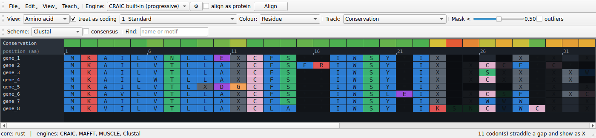
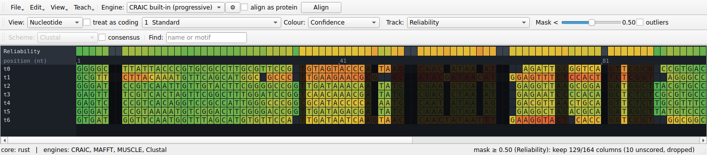
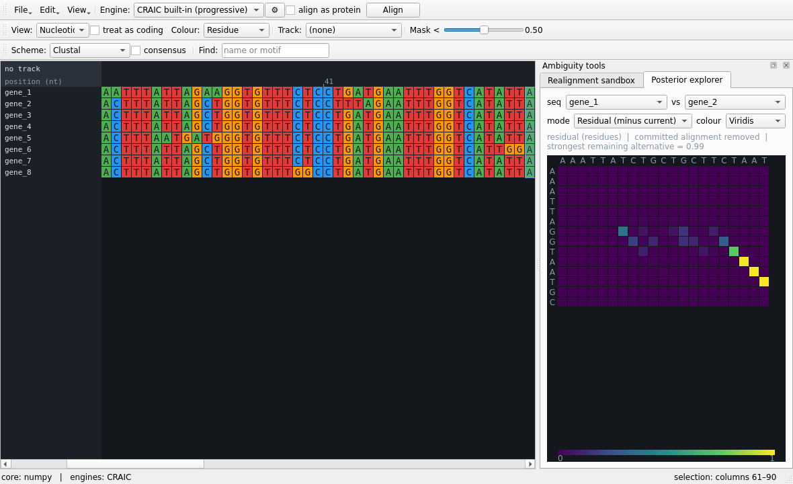
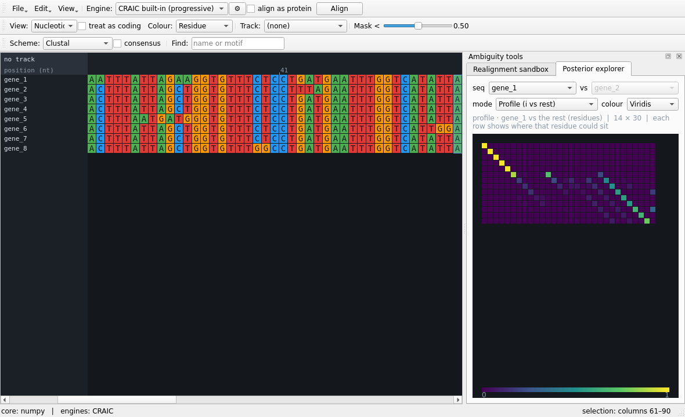
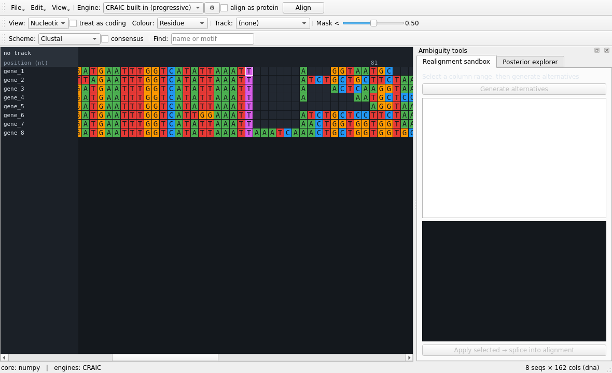

# Tutorial: a guided walkthrough

This takes you from a folder of sequences to a masked, interrogated alignment, touching every
major feature along the way. It uses the bundled `examples/coding_genes.fasta` — eight
protein-coding sequences with conserved cores flanking a deliberately variable loop.

You only need CRAIC [installed](getting-started.md). Everything here works on the NumPy
fallback, so you don't need the Rust core for the tutorial.

---

## 1. Launch and load

```bash
.venv/bin/python -m craic examples/coding_genes.fasta
```

or open CRAIC with `./craic.command` and use **Open…** (Ctrl/⌘+O). Because these sequences are
*unaligned*, CRAIC pads them and tells you so — that's expected. The status bar (bottom-left)
shows the backend (`core: numpy` or `core: rust`) and which engines it found.

## 2. Align as protein

In the top toolbar, leave **Engine** on *CRAIC built-in (progressive)*, tick **align as
protein**, and press **Align**. The built-in aligner scores columns by the pair-HMM posterior
that their residues are homologous and decodes for maximum expected accuracy (the same
posterior the uncertainty tools use). For coding nucleotides, ticking *align as protein*
translates → aligns the amino acids → back-translates, so gaps land on codon
boundaries and the reading frame is never broken. CRAIC keeps the nucleotides in memory and switches to the protein view; flip the
**View** dropdown back to nucleotide or codon whenever you like.

{ width="100%" }

## 3. Switch levels

Use the **View** dropdown to flip between **Nucleotide**, **Codon**, and **Amino acid**. It's
the same underlying alignment, re-projected instantly. The amino-acid view is the quickest way
to see what's conserved.

{ width="100%" }

## 4. Find the uncertain regions

Choose **Reliability** from the **Track** dropdown — the first time, CRAIC computes the analysis
in the background and caches it. It scores every column two independent ways — *consistency*
(does the unaligned-sequence evidence support this column?) and *perturbation* (do its
homologies survive re-alignment across an ensemble of bootstrapped guide trees?) — and lights
up the **track** above the alignment. Green is confident; red/amber is not. The variable loop should glow red
while the cores stay green.

Use the **Track** dropdown to switch the band between the combined *Reliability*, *Consistency*,
and *Perturbation* signals.

## 5. Colour the alignment by confidence

Set the **Colour** dropdown to **Confidence**. Now the residues themselves are shaded by
reliability, so uncertainty shows up exactly where you're reading.

{ width="100%" }

## 6. Preview and export a mask

Drag the **Mask <** slider. The status bar reports how many columns survive the threshold
(e.g. *keep 132/156 columns*), and columns that would be dropped dim out live — no commitment
until you press **Export masked…**, which writes the trimmed alignment to FASTA.

The **Track** dropdown also offers standard *model-free* trimmers as alternatives to the
model-based reliability: **Gap fraction** (MSA_trimmer-style) and **Similarity** (trimAl-style)
are score bands the same slider trims, while **trimAl gappyout**, **trimAl strict**, and
**Gblocks** pick their own columns automatically (the slider yields to their decision).
**Export masked…** writes whichever mask is currently shown. Tick **outliers** to flag whole
sequences that align poorly with the rest (EvalMSA / OD-seq-style) — they get a red marker in
the name column.

## 7. See where the aligners disagree

Choose **Aligner agreement** from the **Track** dropdown. CRAIC re-aligns with every engine it
can find — or, if you have no
external aligners installed, with three gap regimes of the built-in one — and colours each
column by how often the methods agree. Disagreement is the most honest signal of ambiguity, and
it should track the same variable loop.

## 8. Select the hard region

**Click-drag** across the variable loop in the alignment. The selection is highlighted in blue
and is now the input to both ambiguity panels. The **Ambiguity tools** panel is hidden by default — open it from the **View** menu (*Ambiguity tools panel*) to dock it on the right.

## 9. Re-align just that block (sandbox)

Open the **Realignment sandbox** tab and press **Generate alternatives**. CRAIC re-aligns *only*
the selected columns under several engines and gap costs, scoring each by sum-of-pairs identity.
Click an alternative to **preview** it, then **Apply selected → splice into alignment** to drop
your choice back in without touching the rest.

## 10. Read the posterior

Open the **Posterior explorer** tab and pick two sequences. The default **Posterior** mode shows
the pair-HMM homology matrix for your selected region — a bright diagonal where the alignment is
confident, off-diagonal smears where it isn't. Then switch **mode**:

- **Residual (minus current)** subtracts the committed alignment, so the boring diagonal
  vanishes and only the genuine alternatives remain.

  { width="100%" }

- **Profile (i vs rest)** shows one sequence against the whole alignment rather than an
  arbitrary pair.

  { width="100%" }

## 11. Probe a single residue

**Single-click** any residue in the variable loop. CRAIC paints its *homology cloud* — every
column it could plausibly align to, brightness ∝ probability. A tight cloud means a solid
homology; a spread-out one means it could slide.

{ width="100%" }

## 12. Save

**Save…** (Ctrl/⌘+S) writes the current alignment as FASTA or PHYLIP.

---

## Where to next

- The [Interface reference](reference/interface.md) documents every control in detail.
- [Concepts & methods](concepts.md) explains what the scores actually mean.
- [Engines & file formats](reference/engines-and-formats.md) covers external aligners and the
  formats CRAIC reads and writes.
